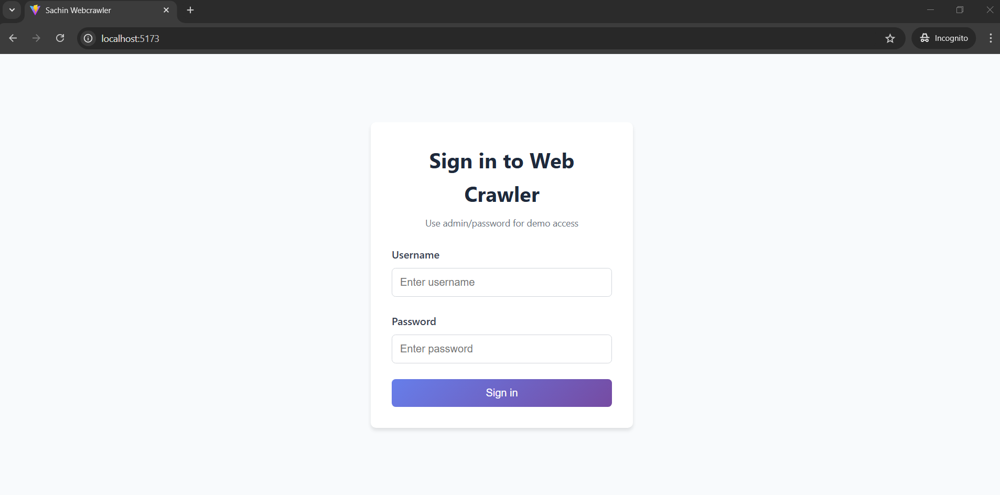
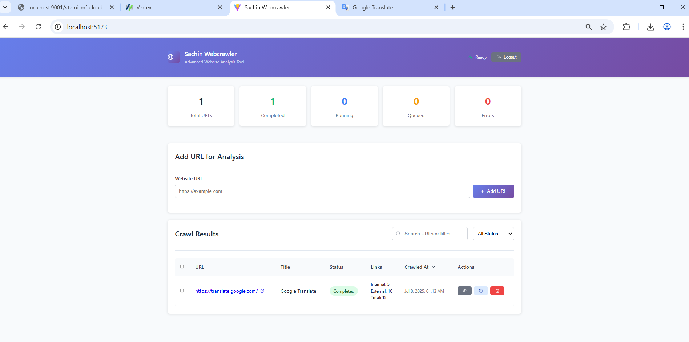
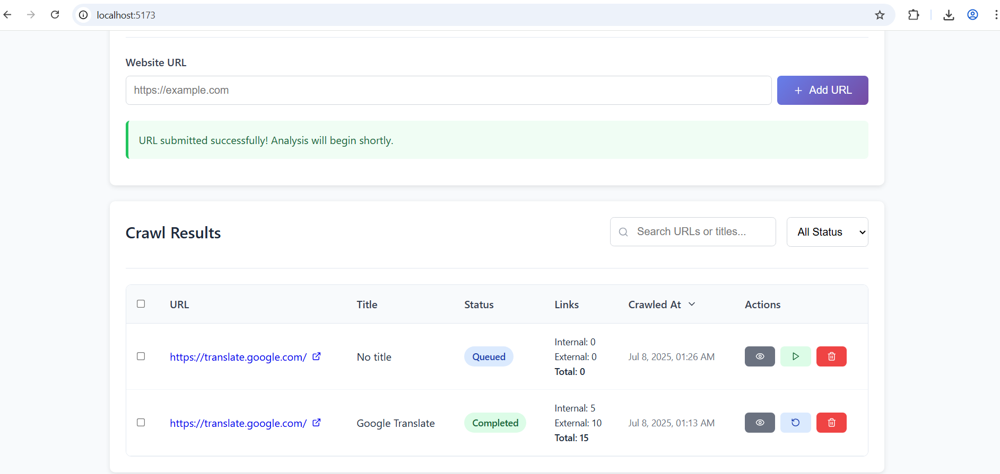
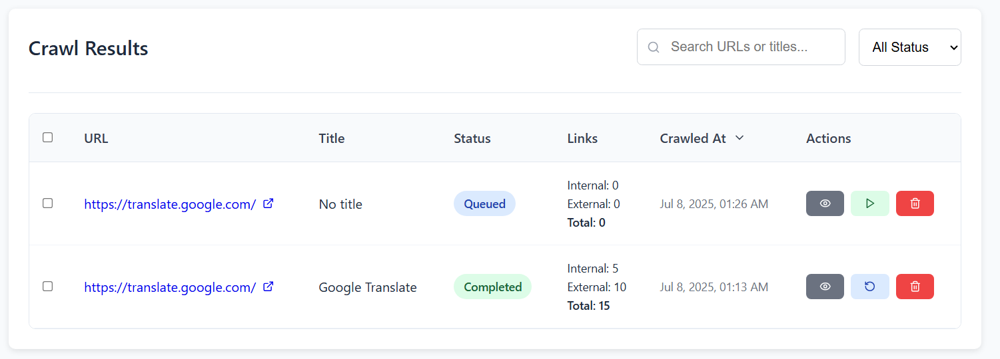
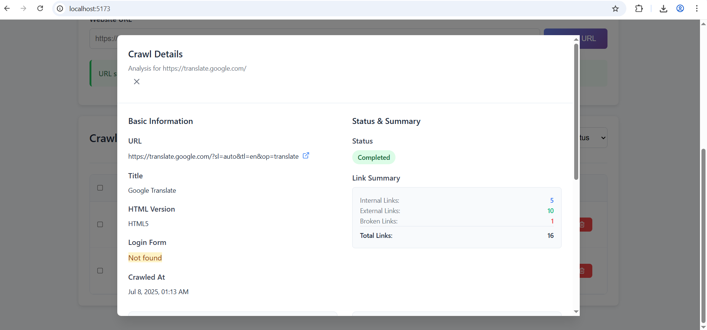
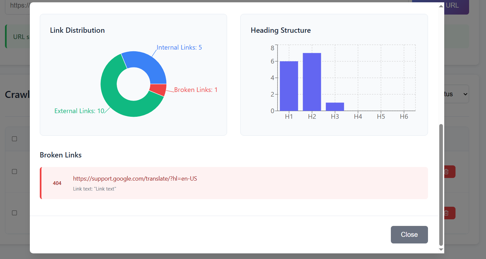

# Web Crawler Application

A production-ready, full-stack web crawler application built with React (TypeScript) frontend and Go backend.

## Architecture

### Frontend
- **React 19** with TypeScript for type safety
- **Vite** for fast development and building
- **Custom CSS** with semantic classes for modern, responsive design
- **TanStack React Query** for efficient state management and API caching
- **Axios** for HTTP client with interceptors
- **Recharts** for data visualization
- **Lucide React** for modern icons

### Backend
- **Go (Golang)** REST API with Gin framework
- **MySQL** database with GORM ORM
- **JWT** authentication and authorization
- **CORS** enabled for cross-origin requests
- **Background job processing** for crawling tasks
- **Docker** support for containerization

## Features

### URL Management
- ✅ Submit URLs for crawling
- ✅ Real-time status tracking (queued, running, completed, error)
- ✅ Start/stop individual crawls
- ✅ Delete crawl results
- ✅ Search and filter results

### Web Crawling Analysis
- ✅ HTML version detection
- ✅ Page title extraction
- ✅ Heading count analysis (H1-H6)
- ✅ Internal vs external link categorization
- ✅ Broken link detection with status codes
- ✅ Login form detection
- ✅ Crawl timestamp tracking

### Dashboard & Visualization
- ✅ Real-time statistics dashboard
- ✅ Sortable and filterable results table
- ✅ Detailed modal views for each crawl
- ✅ Responsive design for mobile and desktop
- ✅ Charts and graphs for data visualization

### Bulk Operations
- ✅ Bulk start multiple crawls
- ✅ Bulk stop crawls
- ✅ Bulk delete results
- ✅ Bulk export functionality

### Authentication & Security
- ✅ JWT-based authentication
- ✅ Protected API endpoints
- ✅ Automatic token refresh handling
- ✅ Secure password handling

## 📸 Screenshots

### Login Screen

*Secure authentication interface with username and password*

### Dashboard Overview

*Main dashboard showing URL submission form and crawl results overview*

### URL Submission

*Clean and intuitive URL submission interface*

### Results Table

*Comprehensive results table with sorting, filtering, and bulk operations*

### Detailed Analysis

*In-depth crawl analysis with interactive charts and broken links report*

### Real-time Statistics

*Live statistics dashboard with data visualization*

## Quick Start

### Prerequisites
- **Node.js** 18+ 
- **Go** 1.21+
- **Docker** 20.10+ and Docker Compose 2.0+
- **MySQL** 8.0+ (or use Docker container)
- **Git**

### Option 1: Full Docker Environment (Recommended)
```bash
# Clone and start everything with Docker
git clone <repository-url>
cd WebCrawlerApp

# Production environment
docker-compose up -d

# Development environment (with phpMyAdmin, MailHog, etc.)
docker-compose -f docker-compose.dev.yml up -d
```

**Access Points:**
- **Production**: Frontend at http://localhost:3000, API at http://localhost:8080
- **Development**: Database tools at http://localhost:8081 (phpMyAdmin)

### Option 2: Local Development Setup
```bash
# Windows users
.\dev.ps1 install    # Install all dependencies
.\dev.ps1 dev        # Start database services
.\dev.ps1 frontend   # Start React dev server (separate terminal)
.\dev.ps1 backend    # Start Go API server (separate terminal)

# Linux/Mac users  
make install         # Install all dependencies
make dev            # Start database services
make frontend       # Start React dev server (separate terminal)
make backend        # Start Go API server (separate terminal)
```

### Option 3: Manual Setup
```bash
cd backend

# Install Go dependencies
go mod tidy

# Configure environment
cp .env.example .env
# Edit .env with your MySQL credentials

# Create database
mysql -u root -p
CREATE DATABASE webcrawler;

# Run the API server
go run main.go
```

The backend will start on `http://localhost:8080`

### 3. Frontend Setup
```bash
# In project root directory
npm install

# Configure environment
cp .env.example .env
# Edit .env if needed (default points to localhost:8080)

# Start development server
npm run dev
```

The frontend will start on `http://localhost:5173`

### 4. Default Authentication
For development, use these credentials:
- **Username:** admin
- **Password:** password

## Database Schema

### CrawlResult Table
- `id` (Primary Key, UUID)
- `url` (Target URL)
- `title` (Page title)
- `html_version` (Detected HTML version)
- `h1_count` through `h6_count` (Heading counts)
- `internal_links_count` (Number of internal links)
- `external_links_count` (Number of external links)
- `broken_links_count` (Number of broken links found)
- `has_login_form` (Boolean for login form detection)
- `status` (queued, running, completed, error)
- `error_message` (Error details if failed)
- `crawled_at` (Completion timestamp)
- `created_at`, `updated_at`, `deleted_at`

### BrokenLink Table
- `id` (Primary Key)
- `crawl_result_id` (Foreign Key)
- `url` (Broken link URL)
- `status_code` (HTTP status code)
- `text` (Link text)
- `created_at`

## API Endpoints

### Authentication
- `POST /api/auth/login` - User login
- `POST /api/auth/register` - User registration

### URL Management
- `POST /api/urls` - Submit new URL
- `GET /api/urls` - Get all crawl results (with pagination/filtering)
- `GET /api/urls/:id` - Get specific crawl result
- `DELETE /api/urls/:id` - Delete crawl result

### Crawl Operations
- `POST /api/urls/:id/start` - Start crawling
- `POST /api/urls/:id/stop` - Stop crawling

### Bulk Operations
- `POST /api/urls/bulk-delete` - Delete multiple results
- `POST /api/urls/bulk-start` - Start multiple crawls

### Statistics
- `GET /api/stats` - Get crawling statistics

## Environment Variables

### Frontend (.env)
```bash
VITE_API_BASE_URL=http://localhost:8080/api
VITE_ENABLE_DEV_TOOLS=true
VITE_USE_MOCK_DATA=false
```

### Backend (.env)
```bash
# Database
DB_HOST=localhost
DB_PORT=3306
DB_USER=root
DB_PASSWORD=your_password
DB_NAME=webcrawler

# Server
PORT=8080
GIN_MODE=debug

# JWT
JWT_SECRET=your-super-secure-jwt-secret

# CORS
ALLOWED_ORIGINS=http://localhost:5173,http://localhost:3000

# Crawler
MAX_CONCURRENT_CRAWLS=5
CRAWL_TIMEOUT=30
```

## Production Deployment

### Docker Deployment
```bash
# Build and run backend
cd backend
docker build -t webcrawler-api .
docker run -p 8080:8080 --env-file .env webcrawler-api

# Build and run frontend
cd ..
docker build -t webcrawler-frontend .
docker run -p 80:80 webcrawler-frontend
```

### Manual Deployment
```bash
# Build frontend
npm run build
# Deploy dist/ folder to web server

# Build backend
cd backend
go build -o webcrawler-api
# Deploy binary with .env file
```

## Development

### Running Tests
```bash
# Frontend tests
npm run test

# Backend tests
cd backend
go test ./...
```

### Code Quality
```bash
# Frontend linting
npm run lint

# Backend formatting
cd backend
go fmt ./...
```

## Features in Detail

### Real-time Updates
The application uses React Query with automatic refetching to provide real-time updates of crawl statuses without manual refresh.

### Responsive Design
Built with semantic CSS classes and modern styling, the application works seamlessly on desktop, tablet, and mobile devices.

### Error Handling
Comprehensive error handling with user-friendly messages and automatic retry mechanisms.

### Performance
- Frontend: Code splitting, lazy loading, and optimized bundle size with custom CSS
- Backend: Concurrent crawling with configurable limits, efficient database queries
- Database: Proper indexing and optimized queries

### Security
- JWT authentication with automatic token refresh
- CORS configuration for cross-origin requests
- Input validation and sanitization
- SQL injection prevention with GORM

## Troubleshooting

### Common Issues

1. **Database Connection Error**
   - Verify MySQL is running
   - Check database credentials in .env
   - Ensure database exists

2. **CORS Errors**
   - Verify ALLOWED_ORIGINS in backend .env
   - Check frontend API base URL configuration

3. **Authentication Issues**
   - Clear localStorage and try logging in again
   - Verify JWT secret configuration

4. **Crawling Failures**
   - Check target URL accessibility
   - Verify network connectivity
   - Review crawler timeout settings

## Contributing

1. Fork the repository
2. Create a feature branch
3. Make your changes
4. Add tests for new features
5. Submit a pull request

## License

This project is licensed under the MIT License - see the LICENSE file for details.

## Support

For questions or issues, please create an issue in the GitHub repository or contact the development team.

## 📁 Project Structure

```
WebCrawlerApp/
├── 📁 src/                        # React frontend source
│   ├── 📁 components/             # UI components
│   │   ├── App.tsx               # Main application
│   │   ├── Login.tsx             # Authentication
│   │   ├── UrlSubmissionForm.tsx # URL submission
│   │   ├── ResultsTable.tsx      # Results display
│   │   └── DetailModal.tsx       # Detailed view
│   ├── 📁 hooks/                  # Custom React hooks
│   ├── 📁 services/               # API services
│   ├── 📁 types/                  # TypeScript definitions
│   └── 📁 utils/                  # Utility functions
├── 📁 backend/                    # Go backend source
│   ├── 📁 handlers/               # HTTP request handlers
│   ├── 📁 middleware/             # Authentication middleware
│   ├── 📁 models/                 # Database models
│   ├── 📁 services/               # Business logic services
│   ├── 📁 config/                 # Configuration
│   ├── main.go                   # API server entry point
│   ├── Dockerfile                # Backend container
│   ├── .env                      # Backend environment
│   └── start-server.bat          # Windows startup script
├── 📁 mysql/                      # Database initialization
│   └── 📁 init/                   # SQL initialization scripts
├── 📁 monitoring/                 # Monitoring configuration
│   └── prometheus.yml            # Metrics collection
├── 🐳 docker-compose.yml          # Production deployment
├── 🐳 docker-compose.dev.yml      # Development environment
├── 🐳 Dockerfile.frontend         # Frontend container
├── ⚙️ nginx.conf                  # Web server configuration
├── 🔧 Makefile                    # Development commands (Linux/Mac)
├── 🔧 dev.ps1                     # Development commands (Windows)
├── 📋 .gitignore                  # Git ignore rules
├── 📚 README.md                   # This file
├── 📚 DEVELOPMENT.md              # Development setup guide
├── 📚 DEPLOYMENT.md               # Production deployment guide
├── 📚 PROJECT_SUMMARY.md          # Feature overview
└── 📦 package.json                # Frontend dependencies
```

## 🛠️ Development Tools

### Windows Users
```powershell
.\dev.ps1 help          # Show all available commands
.\dev.ps1 install       # Install dependencies  
.\dev.ps1 dev           # Start development environment
.\dev.ps1 prod          # Start production environment
.\dev.ps1 clean         # Clean up containers
.\dev.ps1 health        # Check service health
.\dev.ps1 logs          # View service logs
```

### Linux/Mac Users
```bash
make help               # Show all available commands
make install            # Install dependencies
make dev               # Start development environment  
make prod              # Start production environment
make clean             # Clean up containers
make health            # Check service health
make logs              # View service logs
```
